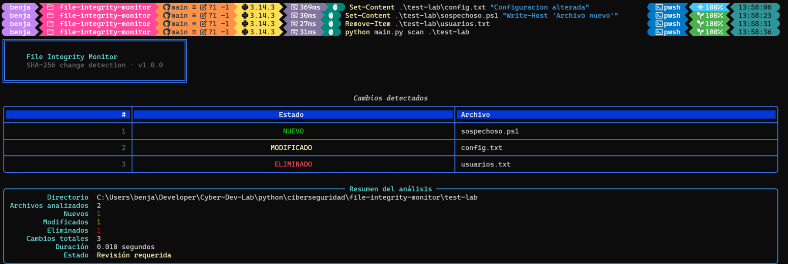

<h1 align="center">🛡️ File Integrity Monitor</h1>

<p align="center">
  <strong>CyberToolkit • Defensive Security Tool</strong>
</p>

<p align="center">
  Detect file modifications using SHA-256 hashing with a modern terminal interface powered by Rich.
</p>

# 🛡️ File Integrity Monitor

> **CyberToolkit • Defensive Security Tool**

A command-line security tool developed in **Python** to detect unauthorized file modifications using **SHA-256 hashing**.

The application creates a baseline of a directory and compares future scans against it, identifying new, modified and deleted files through a clean terminal interface powered by **Rich**.

> ⚠️ This project was developed for **educational and defensive purposes only**.

---

## 📸 Preview

<p align="center">
  
</p>

---

# 🚀 Features

- SHA-256 file hashing
- Baseline generation
- File integrity verification
- Detection of:
  - New files
  - Modified files
  - Deleted files
- Rich terminal interface
- Command Line Interface (CLI)
- JSON baseline storage
- Cross-platform (Windows / Linux)

---

# 🏗️ Project Structure

```text
file-integrity-monitor/
│
├── main.py
├── README.md
├── requirements.txt
├── .gitignore
│
└── monitor/
    ├── __init__.py
    ├── hashing.py
    ├── baseline.py
    └── reporting.py
```

---

# ⚙️ Technologies

- Python 3
- Rich
- hashlib
- pathlib
- argparse
- JSON

---

# 📦 Installation

Clone the repository:

```bash
git clone https://github.com/BenjaminStefano/Cyber-Dev-Lab.git
```

Move into the project:

```bash
cd python/ciberseguridad/file-integrity-monitor
```

Create a virtual environment:

```bash
python -m venv .venv
```

Activate it (PowerShell):

```powershell
.\.venv\Scripts\Activate.ps1
```

Install dependencies:

```bash
pip install -r requirements.txt
```

---

# ▶️ Usage

## Create a baseline

```bash
python main.py init ./folder
```

Example:

```bash
python main.py init ./test-lab
```

---

## Scan a directory

```bash
python main.py scan ./folder
```

Example:

```bash
python main.py scan ./test-lab
```

---

# 🔍 Example Output

```text
Changes Detected

MODIFIED   config.txt

NEW        suspicious.ps1

DELETED    users.txt
```

---

# 🧠 Concepts Practiced

This project helped me practice:

- SHA-256 hashing
- File Integrity Monitoring (FIM)
- Defensive Cybersecurity
- Object-Oriented Design
- Modular Architecture
- CLI Applications
- Rich Terminal UI
- Error Handling
- JSON Persistence
- Python Best Practices

---

# 📚 How It Works

1. Scan all files inside a directory.
2. Calculate a SHA-256 hash for each file.
3. Save those hashes into a baseline.
4. Perform a new scan.
5. Compare both states.
6. Report every detected difference.

---

# 📈 Roadmap

## Version 1.0

- [x] SHA-256 hashing
- [x] Baseline generation
- [x] Rich interface
- [x] CLI
- [x] JSON storage

## Version 1.1

- [ ] Ignore rules
- [ ] Recursive filtering
- [ ] Logging
- [ ] Progress bar

## Version 2.0

- [ ] Real-time monitoring
- [ ] Automatic rescans
- [ ] Email alerts
- [ ] Discord Webhook notifications

## Version 3.0

- [ ] Desktop GUI
- [ ] Dashboard
- [ ] Multiple baseline profiles

---

# 🛡️ Security Notice

This software is intended exclusively for **defensive security**, **learning**, and **system administration**.

Only analyze directories that you own or are explicitly authorized to monitor.

---

# 📄 License

This project is part of the **Cyber-Dev-Lab** repository and is distributed under the MIT License.
